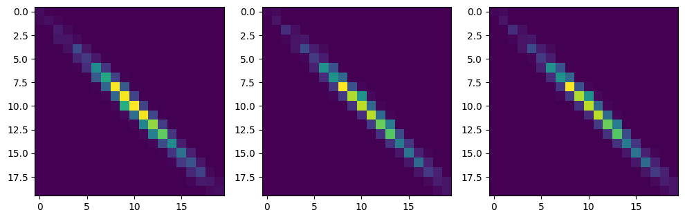
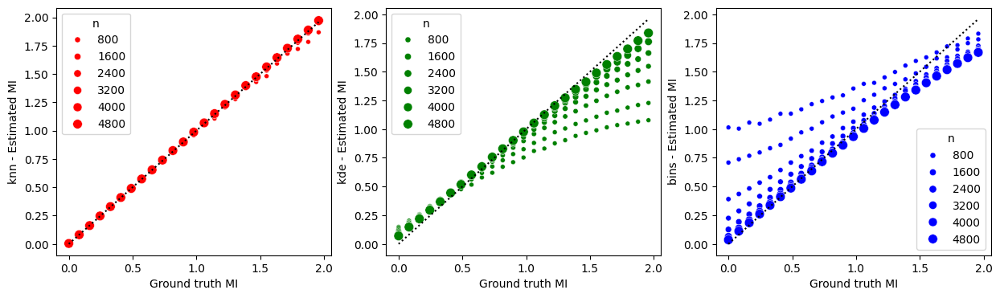
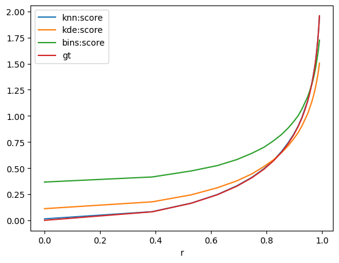

# Python library : torch_mi

The torch_mi library provides implementations of three different methods for calculating Mutual Information:

- KNN (K-Nearest Neighbors)
- KDE (Kernel Density Estimation)
- Vectorized bins count method that can be differentiable.

These methods can be used to measure the amount of information shared between two variables in a dataset


# References :

- [KNN] "Estimating Mutual Information", Alexander Kraskov, Harald Stoegbauer, Peter Grassberger - https://arxiv.org/abs/cond-mat/0305641

- [Bins] https://en.wikipedia.org/wiki/Mutual_information

- [KDE] "Estimation of Mutual Information Using Kernel Density Estimators", Moon, Young-Il & Rajagopalan, Balaji & Lall, Upmanu - https://www.researchgate.net/publication/13324976_Estimation_of_Mutual_Information_Using_Kernel_Density_Estimators


# Install library


```bash
%%bash
if !python -c "import torch_mi" 2>/dev/null; then
    pip install https://github.com/Simon-Bertrand/MutualInformation-PyTorch/archive/main.zip
fi
```

# Import library


```python
import torch_mi
```

# Generate some data and define some utils functions


```bash
%%bash
pip install matplotlib
```

    Requirement already satisfied: matplotlib in ./.venv/lib/python3.10/site-packages (3.8.3)
    Requirement already satisfied: python-dateutil>=2.7 in ./.venv/lib/python3.10/site-packages (from matplotlib) (2.9.0.post0)
    Requirement already satisfied: packaging>=20.0 in ./.venv/lib/python3.10/site-packages (from matplotlib) (24.0)
    Requirement already satisfied: pyparsing>=2.3.1 in ./.venv/lib/python3.10/site-packages (from matplotlib) (3.1.2)
    Requirement already satisfied: pillow>=8 in ./.venv/lib/python3.10/site-packages (from matplotlib) (10.2.0)
    Requirement already satisfied: cycler>=0.10 in ./.venv/lib/python3.10/site-packages (from matplotlib) (0.12.1)
    Requirement already satisfied: numpy<2,>=1.21 in ./.venv/lib/python3.10/site-packages (from matplotlib) (1.26.4)
    Requirement already satisfied: contourpy>=1.0.1 in ./.venv/lib/python3.10/site-packages (from matplotlib) (1.2.0)
    Requirement already satisfied: fonttools>=4.22.0 in ./.venv/lib/python3.10/site-packages (from matplotlib) (4.50.0)
    Requirement already satisfied: kiwisolver>=1.3.1 in ./.venv/lib/python3.10/site-packages (from matplotlib) (1.4.5)
    Requirement already satisfied: six>=1.5 in ./.venv/lib/python3.10/site-packages (from python-dateutil>=2.7->matplotlib) (1.16.0)


```python
import torch, math
from torch.distributions.multivariate_normal import MultivariateNormal
import matplotlib.pyplot as plt


def createCovMat(stdX, stdY, p):
    return torch.tensor([[stdX**2, p * stdX * stdY], [p * stdX * stdY, stdY**2]])


def miGroundTruth(covMat):
    r = covMat[0, 1] / covMat.diag().prod().sqrt()
    return -1 / 2 * math.log(1 - r**2)


def entropyGroundTruth(covMat):
    r = covMat[0, 1] / torch.diag(covMat).prod().sqrt()
    return (
        1 / 2 + 1 / 2 * math.log(2 * math.pi) + math.log(covMat[0, 0].sqrt()),
        1 / 2 + 1 / 2 * math.log(2 * math.pi) + math.log(covMat[1, 1].sqrt()),
        1
        + math.log(2 * math.pi)
        + math.log(torch.diag(covMat).prod().sqrt())
        + 1 / 2 * math.log(1 - r**2),
    )


def getMultivariateNormal(covMat, meanX, meanY):
    return MultivariateNormal(torch.Tensor([meanX, meanY]), covMat)
```


```python
# Define parameters
nNeighbours = 3
nBins = 20

# Define data parameters and generate it
r = 0.99
means = [1, 1]
covMat = createCovMat(1, 1, r)
B, C, H, W = 1, 1, 32, 32
x, y = getMultivariateNormal(covMat, *means).sample((B, C, H, W)).moveaxis(-1, 0)

# Print ground truth mutual information for the normal multivariate case
print("Ground truth MI:", miGroundTruth(covMat))

# Instanciate four methods
rangeOpts = dict(percentile=0.001, gain=0)
binsMiSoft = torch_mi.BinsCountMutualInformation(
    nBins=nBins, mode="soft", rangeOpts=rangeOpts
)  # Default mode
binsMiDiscrete = torch_mi.BinsCountMutualInformation(
    nBins=nBins, mode="discrete", rangeOpts=rangeOpts
)
kdeMi = torch_mi.KdeMutualInformation(nBins=nBins, rangeOpts=rangeOpts)
knnMi = torch_mi.KnnMutualInformation(nNeighbours=nNeighbours)

BC, HW = x.size(0) * x.size(1), x.size(2) * x.size(3)
```

    Ground truth MI: 1.9585186697929657


# Plot density based joint distribution


```python
fig, axes = plt.subplots(1, 3, figsize=(12, 5))
axes[0].imshow(kdeMi.computePxy(x.view(BC, HW), y.view(BC, HW))[0])
axes[1].imshow(binsMiSoft.computePxy(x.view(BC, HW), y.view(BC, HW))[0])
axes[2].imshow(binsMiDiscrete.computePxy(x.view(BC, HW), y.view(BC, HW))[0])
```


    <matplotlib.image.AxesImage at 0x7f3d8341dc60>


    

    


# Compute Mutual Information for each method


```python
dict(
    binsMiSoft=float(binsMiSoft(x, y)),
    binsMiDiscrete=float(binsMiDiscrete(x, y)),
    kdeMi=float(kdeMi(x, y)),
    knnMi=float(knnMi(x, y)),
    gt=float(miGroundTruth(covMat)),
)
```


    {'binsMiSoft': 1.7509595155715942,
     'binsMiDiscrete': 1.7509595155715942,
     'kdeMi': 1.6319304704666138,
     'knnMi': 2.012399673461914,
     'gt': 1.9585186697929657}


# Compute some stats


```bash
%%bash
pip install tqdm pandas
```

    Requirement already satisfied: tqdm in ./.venv/lib/python3.10/site-packages (4.66.2)
    Requirement already satisfied: pandas in ./.venv/lib/python3.10/site-packages (2.2.1)
    Requirement already satisfied: pytz>=2020.1 in ./.venv/lib/python3.10/site-packages (from pandas) (2024.1)
    Requirement already satisfied: tzdata>=2022.7 in ./.venv/lib/python3.10/site-packages (from pandas) (2024.1)
    Requirement already satisfied: python-dateutil>=2.8.2 in ./.venv/lib/python3.10/site-packages (from pandas) (2.9.0.post0)
    Requirement already satisfied: numpy<2,>=1.22.4 in ./.venv/lib/python3.10/site-packages (from pandas) (1.26.4)
    Requirement already satisfied: six>=1.5 in ./.venv/lib/python3.10/site-packages (from python-dateutil>=2.8.2->pandas) (1.16.0)


```python
import time
import pandas as pd
from tqdm import tqdm

nRealizations = 64


def task(args):
    r, n = args
    covMat = createCovMat(1, 1, r)
    means = [0, 0]
    x, y = getMultivariateNormal(covMat, *means).sample((nRealizations, 1, n, n)).moveaxis(-1, 0)
    start = time.time()
    knn = knnMi(x, y).mean()
    knnTime = 1000 * (time.time() - start) / nRealizations

    start = time.time()
    kde = kdeMi(x, y).mean()
    kdeTime = 1000 * (time.time() - start) / nRealizations

    start = time.time()
    bins = binsMiSoft(x, y).mean()
    binsTime = 1000 * (time.time() - start) / nRealizations

    return {
        "n": float(n**2),
        "r": float(r),
        "gt": float(miGroundTruth(covMat)),
        **dict(zip(["varX", "varY"], covMat.diag().tolist())),
        **dict(zip(["meanX", "meanY"], means)),
        "knn:score": float(knn),
        "kde:score": float(kde),
        "bins:score": float(bins),
        "knn:duration": float(knnTime),
        "kde:duration": float(kdeTime),
        "bins:duration": float(binsTime),
    }


rs = (1 - (-2 * torch.linspace(0, -0.5 * math.log(1 - 0.99**2), 25)).exp()).sqrt()
N = torch.logspace(1, 1.85, 7).to(torch.int)

stats = pd.DataFrame(
    list(
        tqdm(
            map(task, ((r, n) for r in rs for n in N)),
            total=len(rs) * len(N),
        )
    )
).assign(
    **{
        "knn:score_err": lambda x: (x["knn:score"] - x["gt"]) / (x["gt"].abs()),
        "kde:score_err": lambda x: (x["kde:score"] - x["gt"]) / (x["gt"].abs()),
        "bins:score_err": lambda x: (x["bins:score"] - x["gt"]) / (x["gt"].abs()),
    }
)
stats
```

    100%|██████████| 175/175 [04:38<00:00,  1.59s/it]


<div>
<style scoped>
    .dataframe tbody tr th:only-of-type {
        vertical-align: middle;
    }

    .dataframe tbody tr th {
        vertical-align: top;
    }

    .dataframe thead th {
        text-align: right;
    }
</style>
<table border="1" class="dataframe">
  <thead>
    <tr style="text-align: right;">
      <th></th>
      <th>n</th>
      <th>r</th>
      <th>gt</th>
      <th>varX</th>
      <th>varY</th>
      <th>meanX</th>
      <th>meanY</th>
      <th>knn:score</th>
      <th>kde:score</th>
      <th>bins:score</th>
      <th>knn:duration</th>
      <th>kde:duration</th>
      <th>bins:duration</th>
      <th>knn:score_err</th>
      <th>kde:score_err</th>
      <th>bins:score_err</th>
    </tr>
  </thead>
  <tbody>
    <tr>
      <th>0</th>
      <td>100.0</td>
      <td>0.00</td>
      <td>-0.000000</td>
      <td>1.0</td>
      <td>1.0</td>
      <td>0</td>
      <td>0</td>
      <td>0.026470</td>
      <td>0.148049</td>
      <td>1.014754</td>
      <td>0.050105</td>
      <td>3.156796</td>
      <td>0.040006</td>
      <td>inf</td>
      <td>inf</td>
      <td>inf</td>
    </tr>
    <tr>
      <th>1</th>
      <td>169.0</td>
      <td>0.00</td>
      <td>-0.000000</td>
      <td>1.0</td>
      <td>1.0</td>
      <td>0</td>
      <td>0</td>
      <td>0.022425</td>
      <td>0.141168</td>
      <td>0.708642</td>
      <td>0.156231</td>
      <td>0.055358</td>
      <td>0.057723</td>
      <td>inf</td>
      <td>inf</td>
      <td>inf</td>
    </tr>
    <tr>
      <th>2</th>
      <td>361.0</td>
      <td>0.00</td>
      <td>-0.000000</td>
      <td>1.0</td>
      <td>1.0</td>
      <td>0</td>
      <td>0</td>
      <td>0.021176</td>
      <td>0.125674</td>
      <td>0.390564</td>
      <td>0.720613</td>
      <td>0.091217</td>
      <td>0.136267</td>
      <td>inf</td>
      <td>inf</td>
      <td>inf</td>
    </tr>
    <tr>
      <th>3</th>
      <td>676.0</td>
      <td>0.00</td>
      <td>-0.000000</td>
      <td>1.0</td>
      <td>1.0</td>
      <td>0</td>
      <td>0</td>
      <td>0.012514</td>
      <td>0.114282</td>
      <td>0.224953</td>
      <td>2.707399</td>
      <td>0.122227</td>
      <td>0.232339</td>
      <td>inf</td>
      <td>inf</td>
      <td>inf</td>
    </tr>
    <tr>
      <th>4</th>
      <td>1296.0</td>
      <td>0.00</td>
      <td>-0.000000</td>
      <td>1.0</td>
      <td>1.0</td>
      <td>0</td>
      <td>0</td>
      <td>0.007499</td>
      <td>0.099844</td>
      <td>0.126344</td>
      <td>9.110626</td>
      <td>0.205077</td>
      <td>0.407144</td>
      <td>inf</td>
      <td>inf</td>
      <td>inf</td>
    </tr>
    <tr>
      <th>...</th>
      <td>...</td>
      <td>...</td>
      <td>...</td>
      <td>...</td>
      <td>...</td>
      <td>...</td>
      <td>...</td>
      <td>...</td>
      <td>...</td>
      <td>...</td>
      <td>...</td>
      <td>...</td>
      <td>...</td>
      <td>...</td>
      <td>...</td>
      <td>...</td>
    </tr>
    <tr>
      <th>170</th>
      <td>361.0</td>
      <td>0.99</td>
      <td>1.958519</td>
      <td>1.0</td>
      <td>1.0</td>
      <td>0</td>
      <td>0</td>
      <td>1.969638</td>
      <td>1.413813</td>
      <td>1.725812</td>
      <td>0.684023</td>
      <td>0.090662</td>
      <td>0.134714</td>
      <td>0.005677</td>
      <td>-0.278122</td>
      <td>-0.118818</td>
    </tr>
    <tr>
      <th>171</th>
      <td>676.0</td>
      <td>0.99</td>
      <td>1.958519</td>
      <td>1.0</td>
      <td>1.0</td>
      <td>0</td>
      <td>0</td>
      <td>1.984936</td>
      <td>1.547285</td>
      <td>1.703919</td>
      <td>2.352342</td>
      <td>0.116680</td>
      <td>0.221536</td>
      <td>0.013489</td>
      <td>-0.209972</td>
      <td>-0.129996</td>
    </tr>
    <tr>
      <th>172</th>
      <td>1296.0</td>
      <td>0.99</td>
      <td>1.958519</td>
      <td>1.0</td>
      <td>1.0</td>
      <td>0</td>
      <td>0</td>
      <td>1.982244</td>
      <td>1.662663</td>
      <td>1.687847</td>
      <td>8.944150</td>
      <td>0.199590</td>
      <td>0.426222</td>
      <td>0.012114</td>
      <td>-0.151061</td>
      <td>-0.138202</td>
    </tr>
    <tr>
      <th>173</th>
      <td>2601.0</td>
      <td>0.99</td>
      <td>1.958519</td>
      <td>1.0</td>
      <td>1.0</td>
      <td>0</td>
      <td>0</td>
      <td>1.973207</td>
      <td>1.761444</td>
      <td>1.677549</td>
      <td>35.705552</td>
      <td>0.423536</td>
      <td>0.783280</td>
      <td>0.007499</td>
      <td>-0.100624</td>
      <td>-0.143460</td>
    </tr>
    <tr>
      <th>174</th>
      <td>4900.0</td>
      <td>0.99</td>
      <td>1.958519</td>
      <td>1.0</td>
      <td>1.0</td>
      <td>0</td>
      <td>0</td>
      <td>1.971526</td>
      <td>1.837464</td>
      <td>1.667954</td>
      <td>120.865054</td>
      <td>0.690170</td>
      <td>1.431398</td>
      <td>0.006641</td>
      <td>-0.061809</td>
      <td>-0.148360</td>
    </tr>
  </tbody>
</table>
<p>175 rows × 16 columns</p>
</div>


# Plot method precision


```python
!pip install seaborn
```

    Requirement already satisfied: seaborn in ./.venv/lib/python3.10/site-packages (0.13.2)
    Requirement already satisfied: matplotlib!=3.6.1,>=3.4 in ./.venv/lib/python3.10/site-packages (from seaborn) (3.8.3)
    Requirement already satisfied: numpy!=1.24.0,>=1.20 in ./.venv/lib/python3.10/site-packages (from seaborn) (1.26.4)
    Requirement already satisfied: pandas>=1.2 in ./.venv/lib/python3.10/site-packages (from seaborn) (2.2.1)
    Requirement already satisfied: packaging>=20.0 in ./.venv/lib/python3.10/site-packages (from matplotlib!=3.6.1,>=3.4->seaborn) (24.0)
    Requirement already satisfied: pillow>=8 in ./.venv/lib/python3.10/site-packages (from matplotlib!=3.6.1,>=3.4->seaborn) (10.2.0)
    Requirement already satisfied: contourpy>=1.0.1 in ./.venv/lib/python3.10/site-packages (from matplotlib!=3.6.1,>=3.4->seaborn) (1.2.0)
    Requirement already satisfied: pyparsing>=2.3.1 in ./.venv/lib/python3.10/site-packages (from matplotlib!=3.6.1,>=3.4->seaborn) (3.1.2)
    Requirement already satisfied: fonttools>=4.22.0 in ./.venv/lib/python3.10/site-packages (from matplotlib!=3.6.1,>=3.4->seaborn) (4.50.0)
    Requirement already satisfied: cycler>=0.10 in ./.venv/lib/python3.10/site-packages (from matplotlib!=3.6.1,>=3.4->seaborn) (0.12.1)
    Requirement already satisfied: python-dateutil>=2.7 in ./.venv/lib/python3.10/site-packages (from matplotlib!=3.6.1,>=3.4->seaborn) (2.9.0.post0)
    Requirement already satisfied: kiwisolver>=1.3.1 in ./.venv/lib/python3.10/site-packages (from matplotlib!=3.6.1,>=3.4->seaborn) (1.4.5)
    Requirement already satisfied: tzdata>=2022.7 in ./.venv/lib/python3.10/site-packages (from pandas>=1.2->seaborn) (2024.1)
    Requirement already satisfied: pytz>=2020.1 in ./.venv/lib/python3.10/site-packages (from pandas>=1.2->seaborn) (2024.1)
    Requirement already satisfied: six>=1.5 in ./.venv/lib/python3.10/site-packages (from python-dateutil>=2.7->matplotlib!=3.6.1,>=3.4->seaborn) (1.16.0)


```python
import seaborn as sns

fig, axis = plt.subplots(1, 3, figsize=(15, 4))
plotsMetadata = [
    dict(y="knn:score", color="r"),
    dict(y="kde:score", color="g"),
    dict(y="bins:score", color="b"),
]
for i, ax in enumerate(axis):
    sns.scatterplot(
        data=stats,
        size="n",
        x="gt",
        y=plotsMetadata[i]["y"],
        ax=ax,
        color=plotsMetadata[i]["color"],
    )
    ax.plot(
        *2 * [torch.linspace(stats["gt"].min(), stats["gt"].max(), 40)],
        linestyle="dotted",
        color="black",
    )
    ax.set_xlabel("Ground truth MI")
    ax.set_ylabel(plotsMetadata[i]["y"].split(":")[0] + " - Estimated MI")
```


    

    


# Plot method dependency with the correlation coefficient


```python
stats.groupby("r").agg(
    {
        "knn:score": "mean",
        "kde:score": "mean",
        "bins:score": "mean",
        "gt": "mean",
    }
).plot()
```


    <Axes: xlabel='r'>


    

    


# Plot method dependency with the correlation coefficient


```python
stats.where((stats["gt"] > 0) & (stats["n"] == stats["n"].max())).assign(
    **{"gt:score_err": lambda x: 0}
).groupby("r").agg(
    {
        "knn:score_err": "mean",
        "kde:score_err": "mean",
        "bins:score_err": "mean",
        "gt:score_err": "mean",
    }
).plot(
    ylim=[-0.50, 0.50], ylabel="Relative error"
)
```


    <Axes: xlabel='r', ylabel='Relative error'>


    

    


# Show method durations


```python
stats.groupby("n").agg(
    {
        "knn:duration": "mean",
        "kde:duration": "mean",
        "bins:duration": "mean",
    }
).plot(ylabel="Computation duration (s)")
```


    <Axes: xlabel='n', ylabel='Computation duration (s)'>


    

    


```python

```
